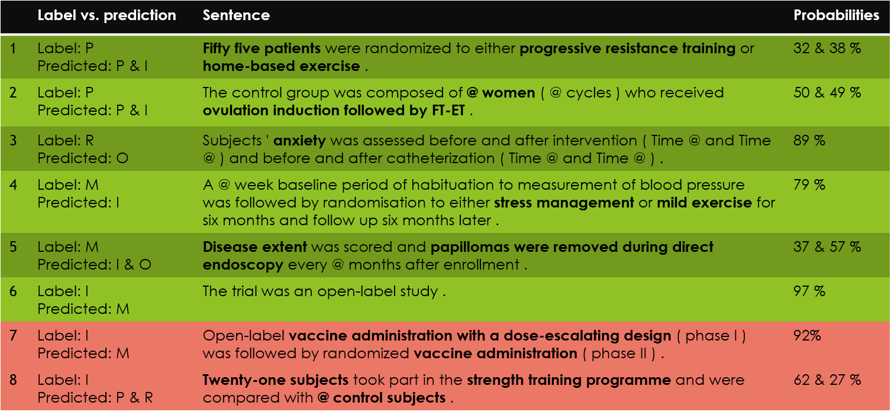
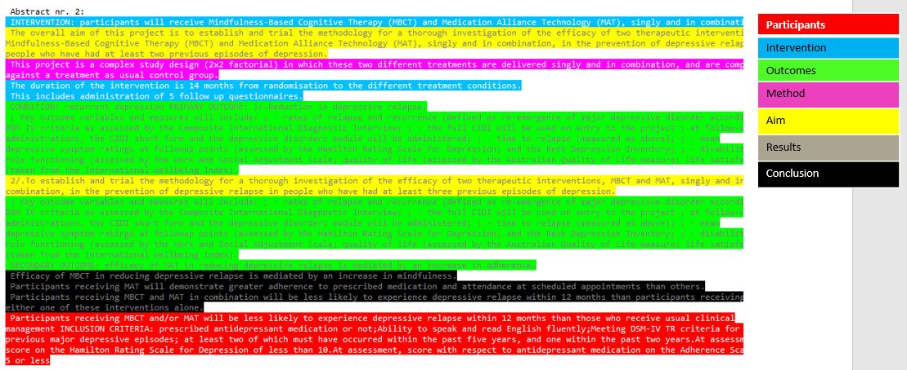
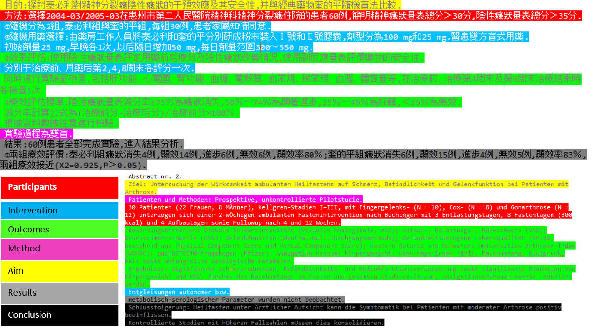
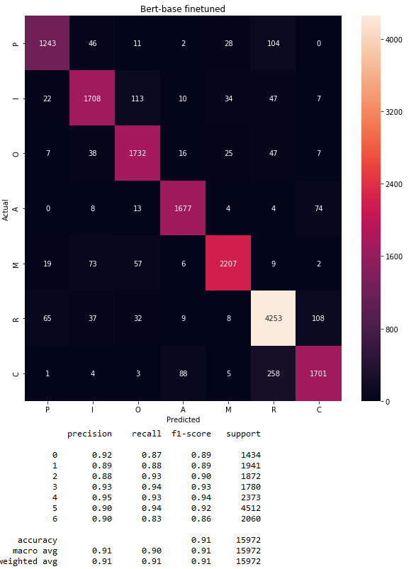
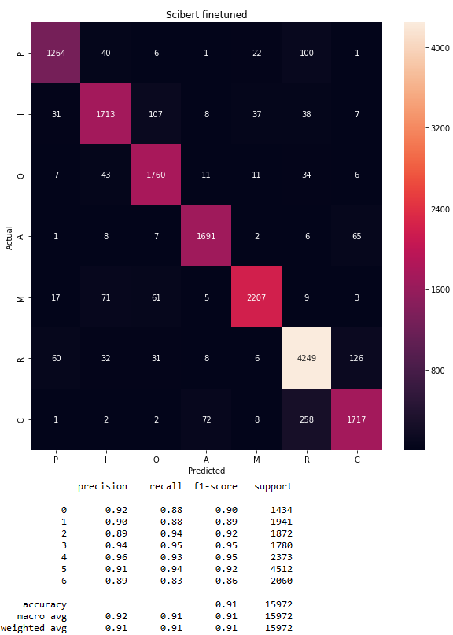
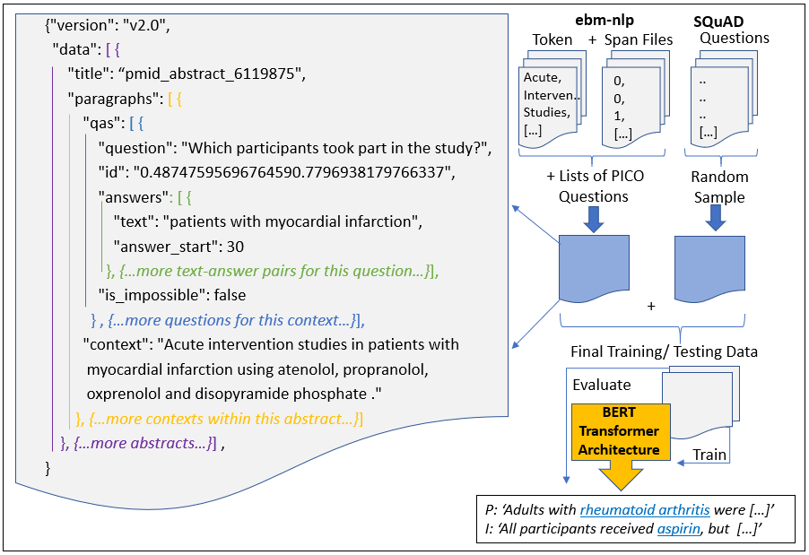
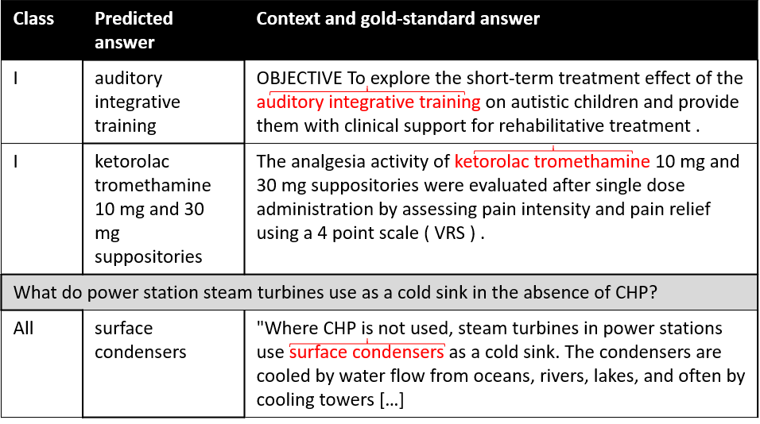
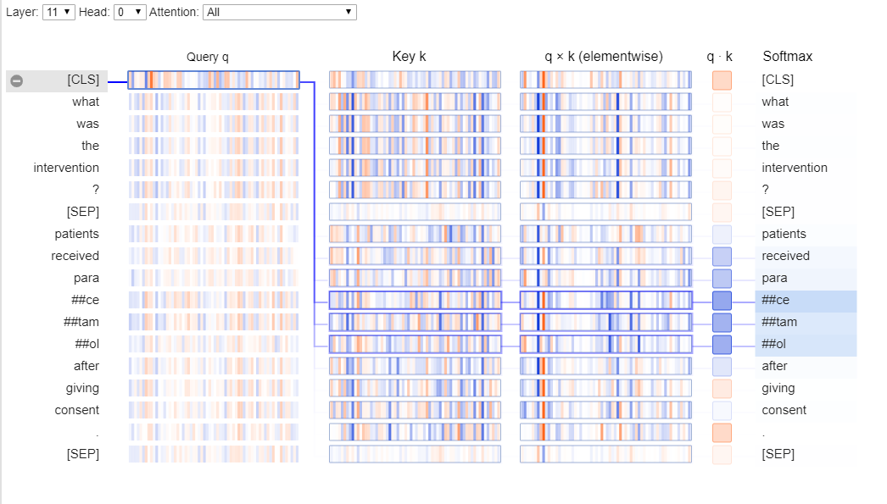

# HealthINF2020
Code and supplementary material for the HealthINF conference paper: Data Mining in Clinical Trial Text: Transformers for Classification and Question Answering Tasks

Abstract:
> This research on data extraction methods applies recent advances in natural language processing to evidence synthesis based on medical texts. Texts of interest include abstracts of clinical trials in English and in multilingual contexts. The main focus is on information characterized via the Population, Intervention, Comparator, and Outcome (PICO) framework, but data extraction is not limited to these fields. Recent neural network architectures based on transformers show capacities for transfer learning and increased performance on downstream natural language processing tasks such as universal reading comprehension, brought forward by this architecture's use of contextualized word embeddings and self-attention mechanisms. This paper contributes to solving problems related to ambiguity in PICO sentence prediction tasks, as well as highlighting how annotations for training named entity recognition systems are used to train a high-performing, but nevertheless flexible architecture for question answering in systematic review automation. Additionally, it demonstrates how the problem of insufficient amounts of training annotations for PICO entity extraction is tackled by augmentation. All models in this paper were created with the aim to support systematic review (semi)automation. They achieve high F1 scores, and demonstrate the feasibility of applying transformer-based classification methods to support data mining in the biomedical literature.

**Original training data sources:**

Sentence data: https://github.com/jind11/PubMed-PICO-Detection

Squad data: https://rajpurkar.github.io/SQuAD-explorer/

Ebm-NLP data: https://github.com/bepnye/EBM-NLP

**Fine-tuning question answering information:**

Fine-tuning can be carried out via the provided Google Colaboraty notebooks (NB enable GPU runtime for full training speed! And a Google account is needed in order to connect the Drive and save the weights). Please note that all other pre-processing (indicated by .py script), as well as conversion to Squad format, was carried out on a local machine.

The Question Answering model was built on a previous version of the Transformers library. This library is constantly changing because its maintainers are very active, which means that errors during training could start showing up at any time. Therefore, all colab scripts have the option to import the library from my local fork. This means that the scripts should run/ be reproducible - just not in the latest version of the Transformers library. 

**Changes after the conference paper was submitted: Question answering**

The amazing people who maintain Transformers give access to many pretrained models: https://huggingface.co/transformers/pretrained_models.html 
In general, this script now produces evaluation results for recall and precision, not only for the testing data as a whole, but also for each individual class (on a token level, it gives extra recall scores for sentences that contained a label, and for sentences that did not contain a PICO, and for the "combined" version: all sentences in this set of testing data).

New best scores for "P(opulation)" class data:

Pretrained model | Under-sampling dominant class | F1 combined | F1 P only | Recall combined | Recall P only
--- | --- | ---| --- | --- | ---
bert-base-uncased (from paper) | na | **87.1**| 74.21 | na | na
bert-base-uncased | 40% | 86.94| 79.55 | 87.6 | 81.77
bert-large-uncased | 40% | 86.98| **80.16** | **87.72** | **82.66**
bert-large-uncased-whole-word-masking-finetuned-squad | 40% | 86.90| 78.91 | 87.59 | 81.24

"bert-large-uncased-whole-word-masking-finetuned-squad" is an already fine-tuned model based on bert-large. It was fine-tuned on the whole Squad dataset, and is available as part of Transformers. I further fine-tuned it on the P-labelled data, but the final model performed marginaly worse than bert-large-uncased as base model, possibly because it has already been fine-tuned on too much different data that is not related to our target task here - see colab training file for more details incl. full scores.

**Scripts for question answering:**

pytorchSquad.ipynb - fine-tune the question answering model via the Google colab script
predictSquad.ipynb - evaluate your fine-tuned question answering model via the Google colab script

**Scripts for sentence classification:**

MultilangPICObert.ipynb - fine-tune the multilingual or scibert or the Google Bert models. Weights for the pretrained models are available from https://github.com/allenai/scibert and https://github.com/google-research/bert

**Additional graphs and figures related to the publication:**

**Sentence classification visualisations and examples:**

Examples for annotation probabilities in sentences that belong to different classes

Examples for predicting and highlighting an English abstract

Examples for predicting and highlighting an German/Chinese abstract

Confusion matrices when assigning single class per sentence:

BERT-base             |  SCIBERT
:-------------------------:|:-------------------------:
  |  

More results and examples, highlighting how the classifier performs on RCT full text, cohort study full text and on an old study can be found in this repo, in the folder "/pictures/fulltexts/"

**Question Answering visualisations and examples:**

Data and model high-level architecture for Question Answering task

Examples for Question answeing predictions, questions, and gold-standard answers

Weights and attentionin fine-tunes QA model

**Please do get in touch if you have any questions/ suggestions /comments !** 

